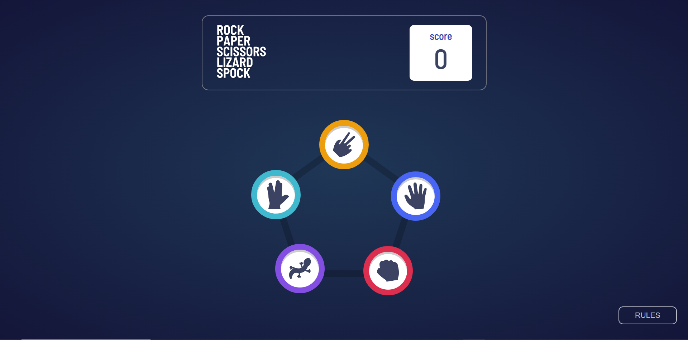
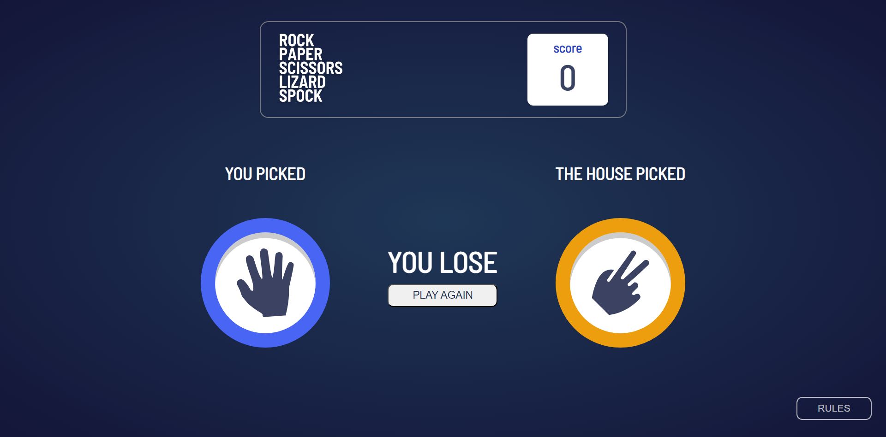
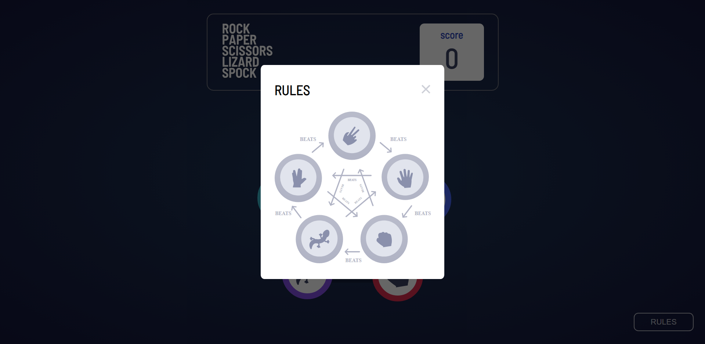

# Rock Paper Scissor Lizard Spock

> This is a simple game where the player can choose from one of the five options (rock, paper, scissor, lizard, or Spock). After the player makes a choice, the game randomly selects an option, and the two choices are compared to determine the winner.

## Table of Contents

- [Installation](#installation)
- [About](#about)
- [Usage](#usage)
- [Contributing](#contributing)
- [Contact](#contact)

## Installation

1. Clone the repo: `git clone https://github.com/Sepehrmasihpour/rock-paper-scissors.git`
2. Install dependencies: `npm install`
3. Note that this application is meant for desktop and is not yet available on phone-sized screens. If time permits, I will upgrade it to support both. But for now, it is only optimized for desktop.

## About

This is a simple game built with React and Sass where players can engage in a variation of the classic game of Rock Paper Scissors. In addition to the traditional options of rock, paper, and scissors, players can also choose from the lizard and Spock options, adding an extra layer of strategy and excitement to the game.

The game works by allowing the player to select one of the five options, and then the game randomly selects an option as well. The choices are then compared to determine the winner based on the rules of the game. The result is displayed to the player, indicating whether they won, lost, or it was a tie.

This project was developed as practice to improve my capabilities in React and Sass and building dynamic web applications. It demonstrates the use of state management, event handling, and conditional rendering to create an engaging user experience.

The design of the app is from [frontend Mentor](https://www.frontendmentor.io) .

Feel free to explore the code and customize it to suit your needs. Enjoy playing Rock Paper Scissor Lizard Spock!

## Usage

After installation, run the application with npm run dev.

Once the application opens, you will immediately be presented with the five options. Simply choose one, and the game will randomly select the other option. The game will then determine the winner and display the result. If you need to learn the rules of the game, you can click the "Rules" button at the bottom of the page.

### pictures of the game

- the five option of the game being presented

  

- What the player has picked vs what the game has picked

  

- Rules of the game

  

## Contributing

Note: This section is included for completeness. We don't anticipate contributions, but you're welcome to try.

1. Fork the Project
2. Create your Feature Branch (`git checkout -b feature/AmazingFeature`)
3. Commit your Changes (`git commit -m 'Add some AmazingFeature'`)
4. Push to the Branch (`git push origin feature/AmazingFeature`)
5. Open a Pull Request
   note.

## Contact

sepehr masihpour - sepehr.masihpour1381@gmail.com
